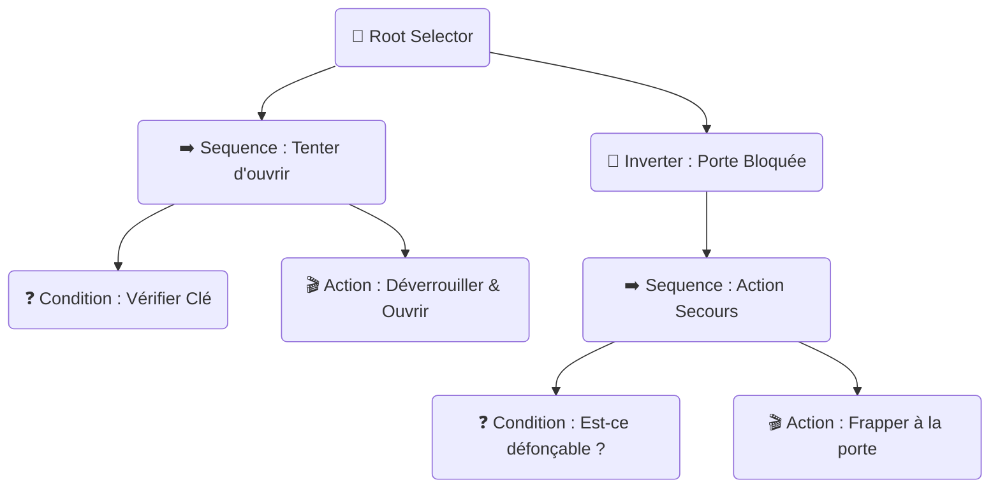

# Mon Projet BehaviorTree.js

## Structure de l'arbre

```mermaid
graph TD
    ROOT("🧠 Root Selector")
    SEQ1("➡️ Sequence : Tenter d'ouvrir")
    COND1("❓ Condition : Vérifier Clé")
    ACT1("🎬 Action : Déverrouiller & Ouvrir")
    INV("🔄 Inverter : Porte Bloquée")
    SEQ2("➡️ Sequence : Action Secours")
    COND2("❓ Condition : Est-ce défonçable ?")
    ACT2("🎬 Action : Frapper à la porte")

    ROOT --> SEQ1
    ROOT --> INV
    SEQ1 --> COND1
    SEQ1 --> ACT1
    INV --> SEQ2
    SEQ2 --> COND2
    SEQ2 --> ACT2
```

